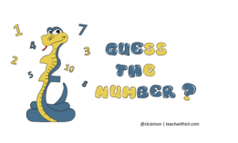

# The "Guess - A - Number" Game
A console based implementation of the "Guess a number" game
(SoftUni, Python Fundamentals, 9. Exercise: Data type and variables)

[Source Code](guess_a_number.py)

**Guess A Number** is a simple guessing game where a **user** is supposed to **guess** the number that **opponent** (the computer) has come up with. The program **randomly** selects a number between **1 and 100**. It will then ask the player to **enter their guess**. Each time you enter a number, **the computer will** tell you whether it is **lower** than the **expected** number.

You **win** the game when your **number** matches **computer** number.
